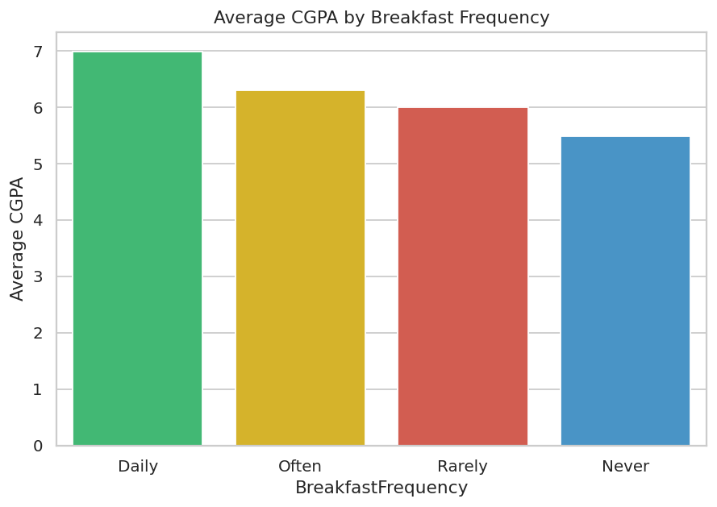
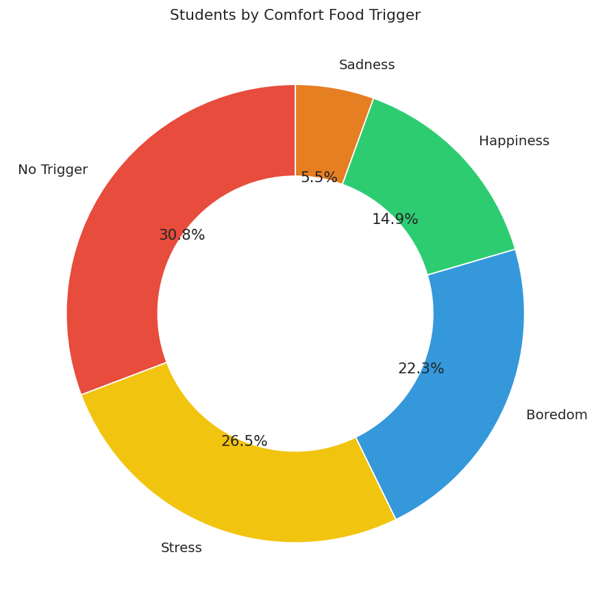
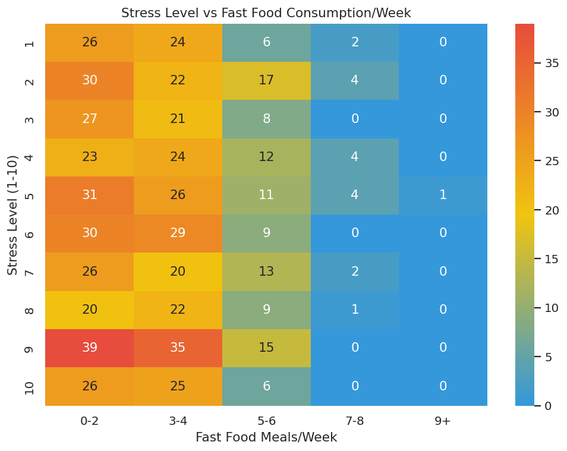
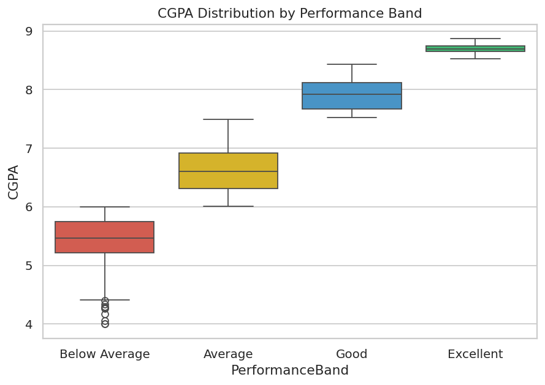
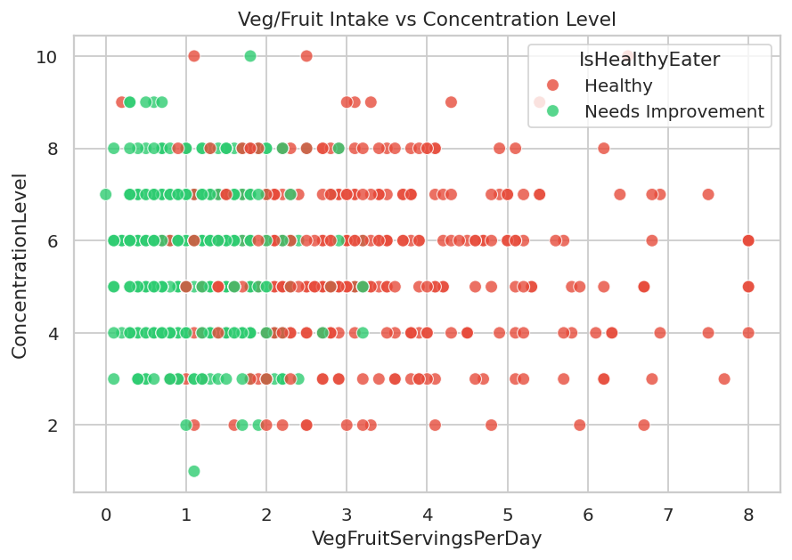
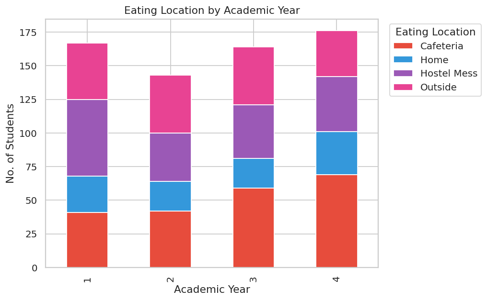
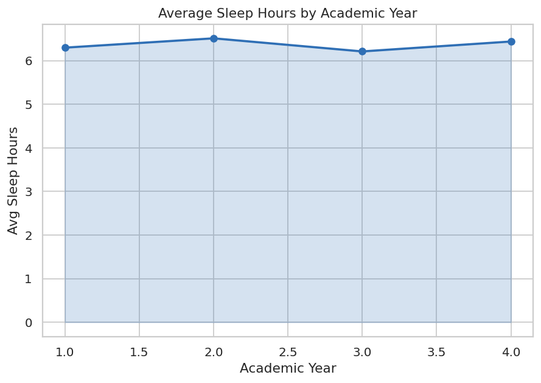
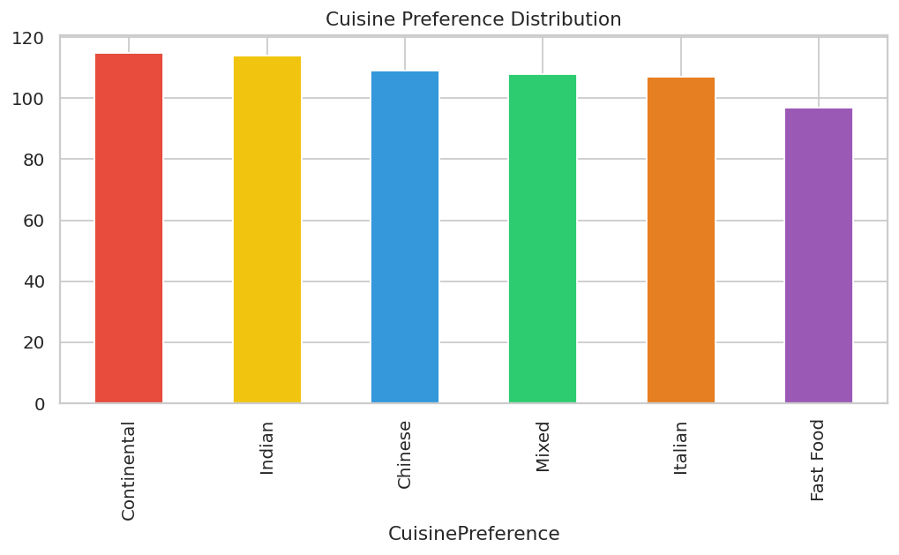
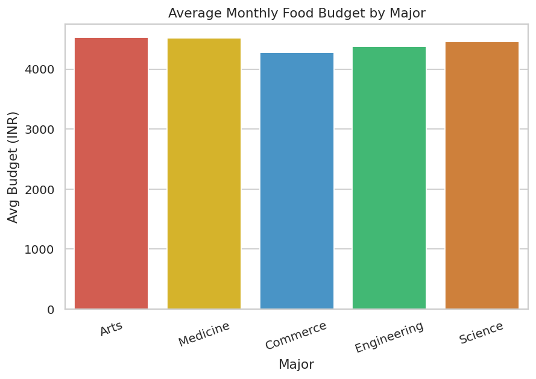
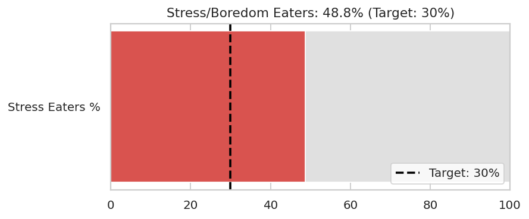

# Comprehensive Analysis and Dietary Strategies with Tableau: A College Food Choices Case Study

NASSCOM Internship Project — Applied analytics project exploring dietary
habits, academic performance, and lifestyle choices among college students,
visualized with Tableau and delivered through a Flask web app.

## 📌 Project Overview
This project transforms a college food-habits survey into an interactive
Tableau dashboard and story, surfacing insights for students, wellness
programs, and cafeteria management (see the 3 scenarios below).

### Scenarios Addressed
1. **Improving Personal Health & Academic Focus** — link between breakfast
   habits and concentration/academic performance.
2. **Managing Stress-Related Eating** — stress/boredom driven comfort-food
   consumption and healthier alternatives.
3. **Improving Cafeteria Food Choices** — low fruit/veg intake vs high
   fast-food consumption to guide menu decisions.
   
### Dashboard Preview






















## 🗂️ Project Structure
```
project/
├── data/
│   ├── raw_college_food_survey.csv        # raw extracted survey data
│   └── college_food_survey_clean.csv      # cleaned, Tableau-ready data
├── generate_dataset.py                    # data collection/extraction script
├── data_preprocessing.py                  # data cleaning + calculated fields
├── app.py                                 # Flask web integration
├── templates/
│   ├── index.html                         # dashboard embed page
│   └── story.html                         # story embed page
├── static/
│   └── style.css
├── TABLEAU_GUIDE.md                       # step-by-step Tableau build guide
├── PROJECT_DOCUMENTATION.md               # full documentation
├── requirements.txt
└── README.md
```

## 🚀 Setup & Run
```bash
# 1. Clone the repo
git clone <your-repo-url>
cd project

# 2. Install dependencies
pip install -r requirements.txt

# 3. (Data already generated, but to regenerate)
python generate_dataset.py
python data_preprocessing.py

# 4. Build the Tableau Dashboard & Story
#    Follow TABLEAU_GUIDE.md, then publish to Tableau Public and
#    paste the view URLs into app.py

# 5. Run the Flask app
python app.py
# Visit http://127.0.0.1:5000
```

## 🛠️ Skills Used
Data Preprocessing · Tableau (BI Software) · Data Modeling · Data
Visualization · Dashboard Design · Flask Web Integration

## Team Members

- Manoj Kumar
- Ansh Jangid
- Kamlesh Meena
- Vikas Khileri
- Yuvraj Verma
  
 ## Use Links
- Github Repo: [GitHub Repository](https://github.com/manojkumar9636/College-Food-Choices-Tableau-Dashboard)
- Tableau Public Profile: [Manoj Kumar](https://public.tableau.com/app/profile/manoj.kumar5931/vizzes)
- Tableau Dashboard: [College Food Survey Dashboard](https://public.tableau.com/app/profile/manoj.kumar5931/viz/CollegeFoodSurveyDashboard/Dashboard1)
- Tableau Story: [Dietary Strategies Story](https://public.tableau.com/app/profile/manoj.kumar5931/viz/DietaryStrategiesStory/ImprovingPersonalHealthAcademicFocus)
- Demo Video: *(add after recording)*

## 📄 License
For academic/internship submission purposes.
